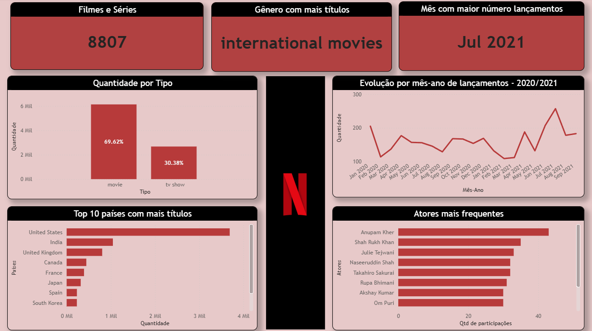
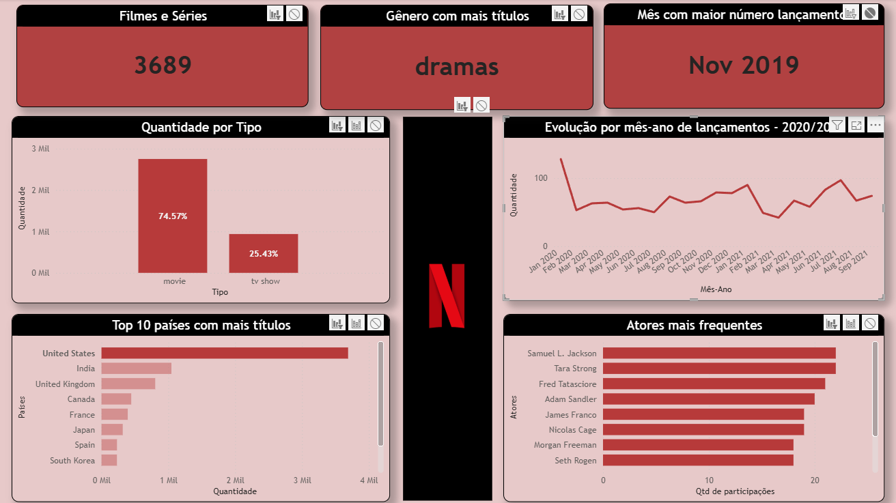
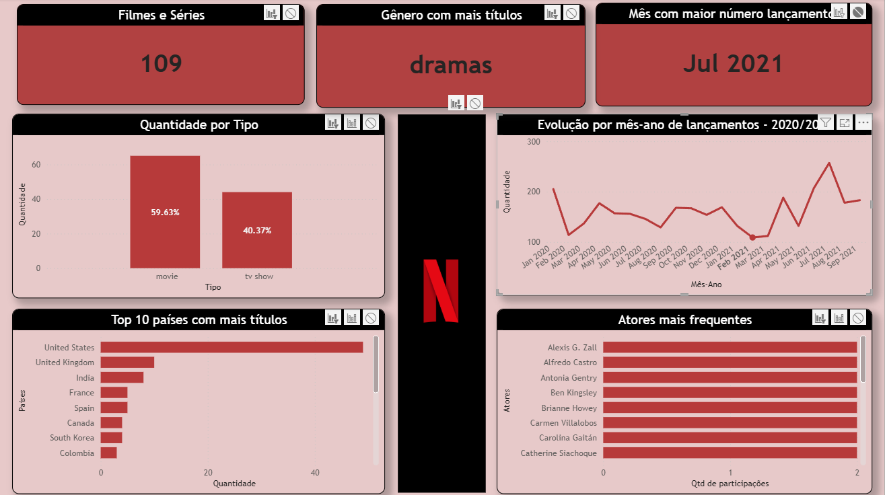
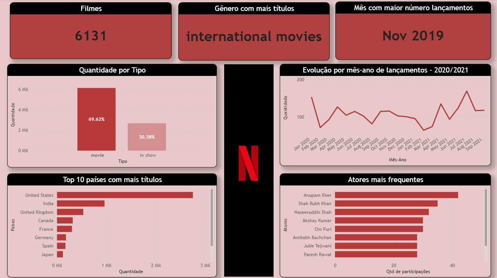
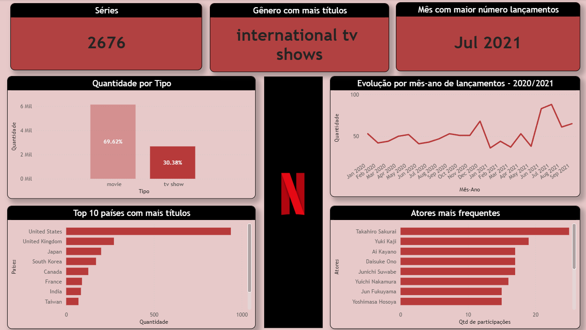
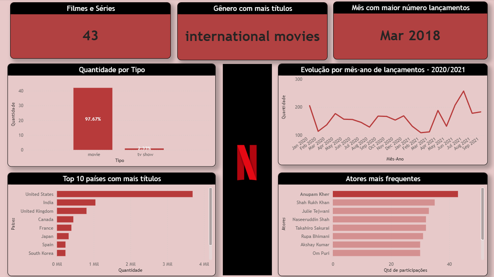
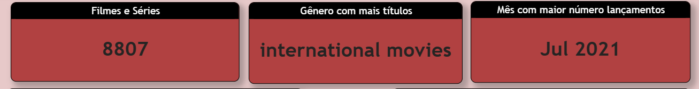

# Análise de Dados Netflix 🎬📊

## 📊 Dashboards e Gráficos

### Dashboard sem Filtro

### 1. Top países com mais títulos 🌍
- **Motivação**: Identificar quais países possuem maior produção de conteúdo na Netflix.  
- **Tipo de gráfico**: Barra vertical  
- **Eixo X**: Contagem de títulos  
- **Eixo Y**: País  
- **Filtragem**: Top 10 países  

**Print do gráfico filtrado:**  

---

### 2. Evolução por mês-ano de lançamentos 📆
- **Motivação**: Analisar tendências de lançamento ao longo do tempo, identificando picos e sazonalidades.  
- **Tipo de gráfico**: Linha  
- **Eixo X**: Mês-Ano concatenado  
- **Eixo Y**: Quantidade de títulos adicionados  
- Ajuste de ordenação para evitar exibição desorganizada  

**Print do gráfico filtrado:**  

---

### 3. Distribuição de Filmes x Séries 🎥📺
- **Motivação**: Comparar o volume de filmes versus séries na plataforma.  
- **Tipo de gráfico**: Barra horizontal  
- Quantidade de filmes e séries
- Adição de data labels para indicar porcentagem exata de cada categoria  

**Print do gráfico filtrado por filmes:**  

**Print do gráfico filtrado por séries:**  

---

### 4. Análise de elenco 👩‍🎤👨‍🎤
- **Motivação**: Identificar os atores que mais participaram de títulos, para análise de frequência de elenco.  
- **Tipo de gráfico**: Barra vertical  
- **Eixo X**: Quantidade de participações  
- **Eixo Y**: Nome do ator  
- Removido `Unknown` ou `Anon` para maior precisão  

**Print do gráfico filtrado:**  

---

### 5. Métricas de KPI 📈
- **Motivação**: Mostrar rapidamente insights-chave da base de dados  
- **Exemplos de KPIs**:
  - Total de filmes  
  - Total de séries  
  - Gênero mais popular (por quantidade de títulos)  
  - Mês com maior taxa de lançamento  
- Utilização de **cards dinâmicos**, com títulos que mudam conforme filtros aplicados  

**Print do gráfico filtrado:**  

---

## 💡 Observações sobre Interatividade
- Alguns filtros foram ajustados para não impactar gráficos sem relação direta (ex.: país não altera elenco)  
- Percentuais calculados dentro do período selecionado, garantindo métricas precisas em filtros temporais  
- Limites de **top N** aplicados para evitar sobrecarga visual e facilitar leitura