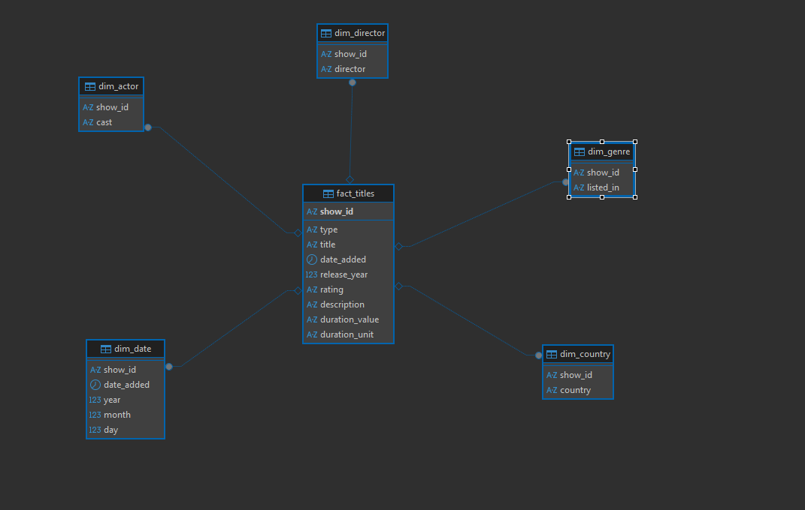

# Descrição

Este projeto consiste em um pipeline ETL completo construído no PostgreSQL, utilizando a base pública da Netflix como fonte de dados.
Os dados foram organizados em três camadas (Raw, Trusted e Refined), passando por etapas de limpeza, padronização e modelagem.
Por fim, foi aplicado um Star Schema para possibilitar análises rápidas e eficientes em ferramentas de BI.

## 📂 Camadas do Data Lake  

### 🗃️ RAW  
- Armazena os dados **originais**, exatamente como foram extraídos da fonte (Netflix).  
- Mantém um **histórico bruto**, sem alterações.  

### 🔎 Python TRUSTED  
Na camada **Trusted**, os dados passam por um processo de **limpeza e padronização** para garantir consistência:  

- **Padronização de colunas** → nomes em minúsculo e com `_` no lugar de espaços.  
- **Datas organizadas** → `date_added` convertido para tipo `datetime`, corrigindo formatos inconsistentes.  
- **Tratamento de duração** → separação da coluna `duration` em `duration_value` e `duration_unit`.  
- **Strings normalizadas** → remoção de espaços extras, valores vazios transformados em `NULL`.  
- **Colunas categóricas ajustadas** → `type`, `rating` e `listed_in` padronizados para minúsculo.  
- **Ratings validados** → valores inconsistentes como "88 min" foram removidos, os valores vazios viram `not_rated`.  

➡️ O objetivo dessa camada é fornecer uma base **limpa, organizada e confiável**, pronta para análises mais avançadas na **Refined**. 

### 📊 Python REFINED  
Na camada **Refined**, os dados da Trusted são organizados em um **modelo dimensional** (fato e dimensões), estruturados para facilitar análises no Power BI ou outras ferramentas:  

- **Fato (fact_titles)** → informações principais sobre os títulos, sem atributos descritivos repetitivos.  
- **Dimensão País (dim_country)** → países normalizados e relacionados aos títulos.  
- **Dimensão Gênero (dim_genre)** → classificação dos conteúdos em múltiplos gêneros.  
- **Dimensão Ator (dim_actor)** → lista de atores vinculados a cada título.  
- **Dimensão Diretor (dim_director)** → diretores vinculados a cada título.  
- **Dimensão Data (dim_date)** → extração de ano, mês e dia da coluna `date_added`.  

➡️ O objetivo é disponibilizar os dados de forma **organizada, eficiente e pronta para análise exploratória e dashboards**, seguindo boas práticas de modelagem dimensional (Star Schema).

### 🔹 SQL Refined - Chaves e Índices

Após estruturar as tabelas na camada **Refined**, adicionei **chaves primárias e estrangeiras** para garantir **integridade e performance** nas consultas.

- **Chave Primária:**  
  Cada registro na tabela fato `fact_titles` é identificado unicamente pelo `show_id`.

- **Chaves Estrangeiras:**  
  Todas as dimensões (`dim_country`, `dim_genre`, `dim_actor`, `dim_director`, `dim_date`) estão relacionadas à tabela fato através do `show_id`, garantindo **integridade referencial** e evitando registros órfãos.

### Diagrama

